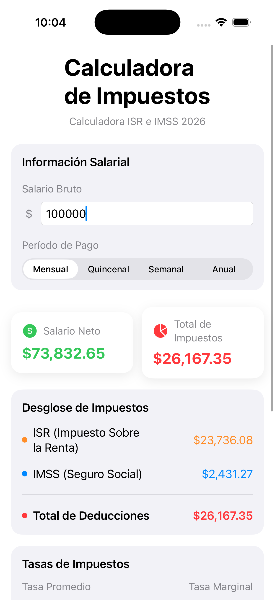
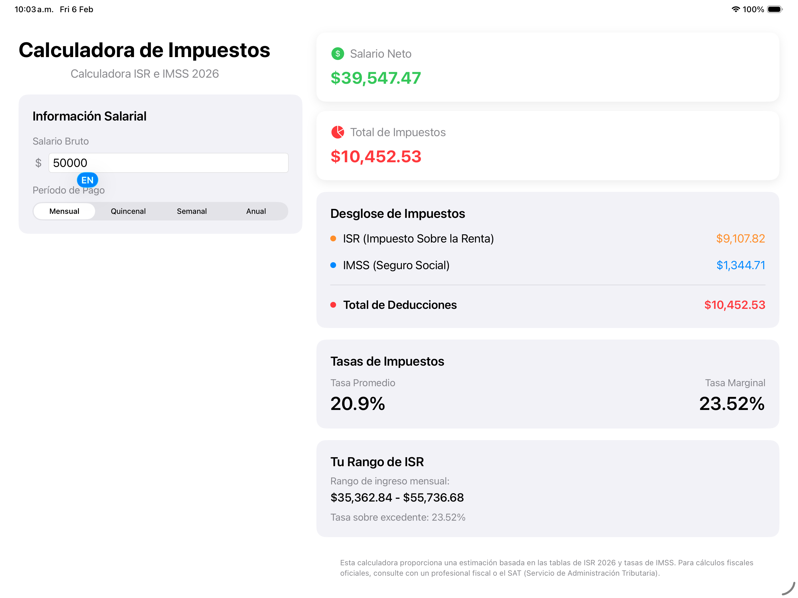

# Mexico Tax Calculator - iOS App

An iOS application for calculating Mexican taxes (ISR and IMSS) based on official 2026 tax tables and rates.

## Screenshots

<table>
  <tr>
    <td align="center">
      
      <br />
      <em>iPhone - Single Column Layout</em>
    </td>
    <td align="center">
      
      <br />
      <em>iPad - Optimized Two-Column Layout</em>
    </td>
  </tr>
</table>

## Features

- **iPad Optimized Layout**: Beautiful two-column design that takes full advantage of iPad's larger screen
- **Responsive Design**: Automatically adapts between iPad's side-by-side layout and iPhone's vertical layout

- **ISR Calculation**: Accurate Income Tax (Impuesto Sobre la Renta) calculation using official 2026 tax brackets from SAT
- **IMSS Calculation**: Social Security (Instituto Mexicano del Seguro Social) employee contributions
- **Multiple Pay Periods**: Support for monthly, bi-weekly, weekly, and annual salary calculations
- **Tax Rate Analysis**: Shows both average and marginal tax rates
- **Tax Bracket Information**: Displays your current tax bracket and applicable rates
- **Real-time Calculations**: Instant tax calculation as you type
- **Clean SwiftUI Interface**: Modern, native iOS design

## Tax Calculation Details

### ISR (Income Tax) - 2026 Brackets

The app uses the official ISR tax brackets for 2026 from Anexo 8 de la Resolución Miscelánea Fiscal:

| Monthly Income Range | Fixed Quota | Rate on Excess |
|---------------------|-------------|----------------|
| $0.01 - $844.59 | $0.00 | 1.92% |
| $844.60 - $7,168.51 | $16.22 | 6.40% |
| $7,168.52 - $12,598.02 | $420.95 | 10.88% |
| $12,598.03 - $14,644.64 | $1,011.68 | 16.00% |
| $14,644.65 - $17,533.64 | $1,339.14 | 17.92% |
| $17,533.65 - $35,362.83 | $1,856.84 | 21.36% |
| $35,362.84 - $55,736.68 | $5,665.16 | 23.52% |
| $55,736.69 - $106,410.50 | $10,457.09 | 30.00% |
| $106,410.51 - $141,880.66 | $25,659.23 | 32.00% |
| $141,880.67 - $425,641.99 | $37,009.69 | 34.00% |
| $425,642.00+ | $133,488.54 | 35.00% |

**Formula**: ISR = Fixed Quota + (Excess Amount × Rate)
Where: Excess Amount = Taxable Income - Lower Bracket Limit

### IMSS (Social Security) - 2026 Rates

Employee contribution components:
- **Sickness and Maternity**: 0.40% (on income above 3 UMAs) + 0.375% (medical expenses) + 0.25% (cash benefits)
- **Disability and Life**: 0.625%
- **Old Age and Severance**: 1.125%
- **Total**: Approximately 2.775% of gross salary

**UMA 2026 Values**:
- Daily: $117.31
- Monthly: $3,566.22

## Project Structure

```
MexicoTaxCalculator/
├── MexicoTaxCalculatorApp.swift    # App entry point
├── Models/
│   ├── TaxBracket.swift            # ISR tax bracket model
│   ├── IMSSConstants.swift         # IMSS rates and constants
│   └── TaxCalculationResult.swift  # Calculation result model
├── Services/
│   └── TaxCalculator.swift         # Tax calculation logic
├── ViewModels/
│   └── TaxCalculatorViewModel.swift # View model for calculator
└── Views/
    └── TaxCalculatorView.swift     # Main UI view
```

## How to Build and Run

1. **Requirements**:
   - Xcode 15.0 or later
   - iOS 17.0 or later
   - macOS for development

2. **Setup**:
   ```bash
   # Open in Xcode
   open MexicoTaxCalculator.xcodeproj

   # Or use Xcode command line
   xcodebuild -project MexicoTaxCalculator.xcodeproj -scheme MexicoTaxCalculator -sdk iphonesimulator
   ```

3. **Create Xcode Project**:
   - Open Xcode
   - Create new iOS App project
   - Name: "MexicoTaxCalculator"
   - Interface: SwiftUI
   - Language: Swift
   - Copy all the source files into the project

4. **File Organization in Xcode**:
   - Create groups (folders) for Models, Views, ViewModels, and Services
   - Drag the corresponding .swift files into each group
   - Ensure all files are added to the target

## Usage Example

For a monthly gross salary of $10,000:
- **ISR**: ~$834
- **IMSS**: ~$242
- **Total Deductions**: ~$1,076
- **Net Salary**: ~$8,924
- **Average Tax Rate**: ~10.8%
- **Marginal Tax Rate**: 21.36%

## Data Sources

This calculator is based on official Mexican tax regulations:

- **ISR Tax Brackets**: SAT Anexo 8 de la Resolución Miscelánea Fiscal 2026
- **IMSS Rates**: Official IMSS employee contribution rates for 2026
- **UMA Values**: 2026 official UMA (Unidad de Medida y Actualización) values

### References

- [Tablas ISR 2026 - ElConta.MX](https://elconta.mx/tablas-y-tarifas-isr-2026-anexo-8-de-la-resolucion-miscelanea-fiscal-2026/)
- [Mexico Tax Calculator - Talent.com](https://mx.talent.com/tax-calculator)
- [IMSS Contributions 2026](https://elconta.mx/calculadora-imss-e-infonavit-2026/)

## Disclaimer

This calculator provides estimates based on 2026 ISR tax brackets and IMSS contribution rates. The calculations are for informational purposes only and should not be considered as official tax advice.

For official tax calculations and compliance, please consult with:
- A certified tax professional
- SAT (Servicio de Administración Tributaria)
- Your employer's payroll department

The calculator makes simplifying assumptions (e.g., marital status, standard deductions) and may not account for all individual circumstances, credits, or deductions that could affect your actual tax liability.

## License

This is an educational project. Feel free to use and modify as needed.

## Contributing

Contributions are welcome! Please ensure any changes maintain accuracy with official SAT and IMSS regulations.
